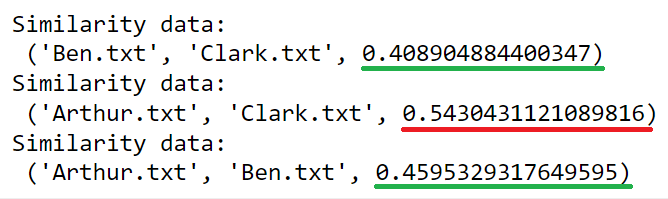

 
<!--  
 

  

## Prerequisites:

1.  <b> Python Basics </b>
2.  <b> sklearn module </b>

---

## Install Necessary Modules:

Open your  Prompt  and type and run the following command (individually):

 -       pip install sklearn  
 
**[`Sklearn`](https://scikit-learn.org/)** (Scikit-learn) is the most useful and robust library for machine learning in Python. It provides a selection of efficient tools for machine learning and statistical modeling including classification, regression, clustering and dimensionality reduction via a consistence interface in Python. This library, which is largely written in Python, is built upon NumPy, SciPy and Matplotlib.

Once Installed now we can import it inside our python code.

---

## Frequently asked questions ❔

### How can I thank you for writing and sharing this tutorial? 🌷

You can  and  Starring and Forking is free for you, but it tells me and other people that it was helpful and you like this tutorial.

Go [**`here`**](https://github.com/milaan9/91_Python_Mini_Projects) if you aren't here already and click ➞ **`✰ Star`** and **`ⵖ Fork`** button in the top right corner. You will be asked to create a GitHub account if you don't already have one.

---

### How can I read this tutorial without an Internet connection? 

1. Go [**`here`**](https://github.com/milaan9/91_Python_Mini_Projects) and click the big green ➞ **`Code`** button in the top right of the page, then click ➞ [**`Download ZIP`**](https://github.com/milaan9/91_Python_Mini_Projects/archive/refs/heads/main.zip).

    

2. Extract the ZIP and open it. Unfortunately I don't have any more specific instructions because how exactly this is done depends on which operating system you run.
    
3. Launch ipython notebook from the folder which contains the notebooks. Open each one of them
  
    `Kernel > Restart & Clear Output`
    
This will clear all the outputs and now you can understand each statement and learn interactively.

If you have git and you know how to use it, you can also clone the repository instead of downloading a zip and extracting it. An advantage with doing it this way is that you don't need to download the whole tutorial again to get the latest version of it, all you need to do is to pull with git and run ipython notebook again.

---
